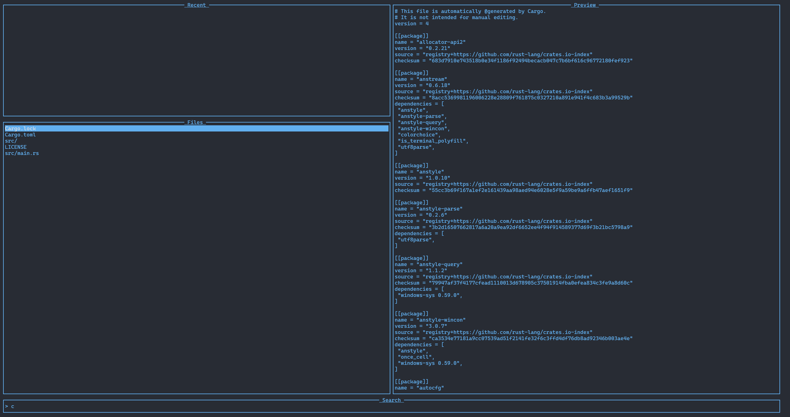

### (V)im (U)ser (I)nterface (T)erminal

A buffer manager layer for Vim that provides a terminal-like interface to search for, open, and edit files.



## Installation

### Mac

clone, Cargo Build, homebrew package tbd...

dependencies: fzf, fd

### Linux

Install .deb package from realeases page.

```bash
sudo dpkg -i vuit_0.1.0_amd64.deb
```
